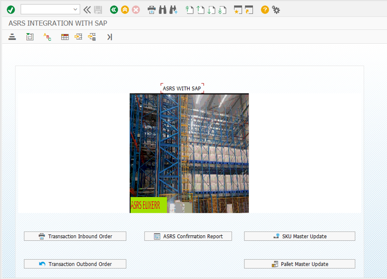

# Technical Specification: Elixrr ASRS Integration

## 1. Introduction
This document details the technical implementation for the integration between SAP and the Elixrr ASRS (Automated Storage and Retrieval System). The solution is designed to act as a **REST API Integration**, utilizing ABAP reports to convert Excel data into JSON payloads and transmit them to the ASRS system.

> **Note**: This REST API integration is the primary data transfer mechanism. In the event of network downtime or API unavailability, a manual upload approach will be utilized as a contingency.

## 3. User Interface
The following screenshot illustrates the main menu cockpit for the ASRS Integration, allowing access to the various upload and reporting tools.



## 4. Object Summary

### 4.1 Reports
| Report Name | Description |
|:-----------:|:-----------:|
| `ZASRS_SKU_MASTER_UPLOAD` | Uploads SKU Master Data to ASRS |
| `ZASRS_PALLET_MASTER_UPLOAD` | Uploads Pallet Master Data to ASRS |
| `ZASRS_INBOUND_TRANSACTN_UPLOAD` | Uploads Inbound Transactions (Receipts) to ASRS |
| `ZASRS_OUTBOUND_TRANSACTN_UPL` | Uploads Outbound Transactions (Issues) to ASRS |
| `ZASRS_REPORT` | Report to view transaction history/status |
| `ZASRS_MPP_F01` | Main Menu / Module Pool (Code snippet found) |

### 4.2 Function Modules
| Function Module | Description |
|:---------------:|:-----------:|
| `ZASRS_TOKEN_GENERATION` | Generates authentication token for API calls |
| `ZASRS_DATA_UPDATE` | Sends JSON payload to ASRS API endpoints |

### 4.3 Custom Tables (Inferred)
| Table Name | Description |
|:----------:|:-----------:|
| `ZASRS_SKU_DETAIL` | Stores SKU Master Data logs/status |
| `ZASRS_PALLET_M` | Stores Pallet Master Data logs/status |
| `ZASRS_TRANS` | Stores Transaction Data (Inbound/Outbound) history |

---

## 5. Detailed Design

### 5.1 Global Logic
All upload programs follow a similar pattern:
1.  **Selection Screen**: Prompt user for an Excel file path.
2.  **File Upload**: Read Excel content into an internal table.
3.  **Data Processing**:
    *   Validate data.
    *   Check specific Custom Tables for existing records/status.
    *   Prepare data for JSON conversion.
4.  **API Communication**:
    *   Convert internal data to JSON string using `/UI2/CL_JSON=>SERIALIZE`.
    *   Perform string replacements to match API field naming conventions (e.g., camelCase).
    *   Call `ZASRS_TOKEN_GENERATION` to get a valid token.
    *   Call `ZASRS_DATA_UPDATE` with the token, JSON payload, and specific URL.
5.  **Database Update**: Update local custom tables with status (Success/Failure).
6.  **Output**: Display processing log using ALV Grid.

### 5.2 Report: ZASRS_SKU_MASTER_UPLOAD
**Purpose**: To synchronize SKU Master data from SAP to ASRS.

*   **API Endpoint**: `http://192.168.1.101:4456/asrs/api/sync/sku`
*   **Source File Columns**: SKU ID, SKU ID Detail, SKU Description, Expiry Days.
*   **JSON Structure**:
    ```json
    [
      {
        "skuId": "string",
        "altSkuId": "string",
        "skuDesc": "string",
        "expiryDays": "string",
        "isActive": "string",   // Mapped if available
        "uomId": "string"       // Mapped if available
      }
    ]
    ```
*   **Logic**:
    *   Reads `ZASRS_SKU_DETAIL` to check if SKU already exists.
    *   Updates status to 'Updated Successfully' upon successful API response (200).
    *   Modifies `ZASRS_SKU_DETAIL`.

### 5.3 Report: ZASRS_PALLET_MASTER_UPLOAD
**Purpose**: To initialize/sync Pallet data.

*   **API Endpoint**: `http://192.168.1.101:4456/asrs/api/pallet/init`
*   **Source File Columns**: Barcode, Weight.
*   **JSON Structure**:
    ```json
    [
      {
        "barcode": "string",
        "weight": "string"
      }
    ]
    ```
*   **Logic**:
    *   Uses `ALSM_EXCEL_TO_INTERNAL_TABLE` for upload.
    *   Checks `ZASRS_PALLET_M`.
    *   Updates `ZASRS_PALLET_M` with status and timestamp.

### 5.4 Report: ZASRS_INBOUND_TRANSACTN_UPLOAD
**Purpose**: To push Inbound Transaction data (e.g., PO Receipts) to ASRS.

*   **API Endpoint**: `http://192.168.1.101:4456/asrs/api/sync/txn`
*   **Source File Columns**: PO No, Vendor, SKU ID, Quantity, Lot No, Article Barcode.
*   **JSON Structure**:
    ```json
    [
      {
        "txnId": "string",
        "txnVendor": "string",
        "type": "I",  // "I" for Inbound
        "sourceItems": [
          {
            "sourceId": "string",
            "skuId": "string",
            "qty": "number",
            "batch": "string",
            "barcodes": ["string", "string"] // Array of barcode strings
          }
        ]
      }
    ]
    ```
*   **Logic**:
    *   Handles grouping: Multiple excel rows can belong to one Transaction (grouped by `txnId`).
    *   Collects multiple barcodes into a `barcodes` array for a single item.
    *   Checks `ZASRS_TRANS`. If successful, sets `in_out` = 'IN' and updates status.

### 5.5 Report: ZASRS_OUTBOUND_TRANSACTN_UPL
**Purpose**: To push Outbound Transaction data to ASRS.

*   **API Endpoint**: `http://192.168.1.101:4456/asrs/api/sync/txn`
*   **Source File Columns**: Transaction ID, Vendor, SKU ID, Quantity.
*   **JSON Structure**:
    ```json
    [
      {
        "txnId": "string",
        "txnVendor": "string",
        "type": "O", // "O" for Outbound
        "sourceItems": [
           {
              "sourceId": "string",
              "skuId": "string",
              "qty": "number"
           }
        ]
      }
    ]
    ```
*   **Logic**:
    *   Checks if `TxnID` exists in `ZASRS_TRANS`.
    *   Sets `in_out` = 'OUT' upon success and updates `ZASRS_TRANS`.

### 5.6 Report: ZASRS_REPORT
**Purpose**: Log display query.

*   **Logic**:
    *   Selects all records from `ZASRS_TRANS`.
    *   Displays fields: TXNID, LIFNR, SKU_ID, QTY, BATCH, BARCODES, ERDAT, UZEIT, IN_OUT.

## 6. Security & Configuration
*   **Token Generation**: Uses `ZASRS_TOKEN_GENERATION`. Implementation details not visible but likely handles authentication (Basic/OAuth) to retrieve a session token.
*   **Hardcoded URLs**: API URLs are currently hardcoded in the reports.
    *   Recommendation: Move URLs to a configuration table (e.g., `TVARVC` or valid custom config table) to avoid code changes for environment switches.

## 7. Assumptions & Dependencies
*   The API server (`192.168.1.101`) is accessible from the SAP Application Server.
*   The function modules `ZASRS_TOKEN_GENERATION` and `ZASRS_DATA_UPDATE` are available and working.
*   The Custom Tables (`ZASRS_*`) exist in the dictionary.
